# Gallery

Every figure below is **real ggplot2** rendered through ggplotpy from Python — no
reimplementation. The data is real too: the [Palmer Penguins][peng] and
[Gapminder][gap] datasets (fetched from the web), plus ggplot2's own `mpg`,
`diamonds`, and `economics`, and `datasets::iris`.

Reproduce the whole page with:

```bash
python docs/scripts/build_gallery.py   # writes docs/_static/gallery/*.png
```

[peng]: https://allisonhorst.github.io/palmerpenguins/
[gap]: https://www.gapminder.org/data/

## Setup used on this page

```python
from ggplotpy import *
import pandas as pd, numpy as np

# external data (saved under docs/data/)
penguins = pd.read_csv("docs/data/penguins.csv").dropna(
    subset=["bill_length_mm", "bill_depth_mm", "body_mass_g", "flipper_length_mm"])

# R's own real datasets, pulled straight into pandas
from ggplotpy.backend.inprocess import r
from rpy2.robjects import conversion
def r_dataset(expr):
    with conversion.localconverter(conversion.get_conversion()):
        return conversion.get_conversion().rpy2py(r().r(expr))

mpg       = r_dataset("ggplot2::mpg")
diamonds  = r_dataset("ggplot2::diamonds").sample(4000, random_state=1)
economics = r_dataset("ggplot2::economics")
```

---

## Core geoms

### Scatter + smooth

```python
(ggplot(penguins)
 + aes(x="bill_length_mm", y="bill_depth_mm", color="species")
 + geom_point(size=2, alpha=0.8)
 + geom_smooth(method="lm", se=False)
 + labs(title="Penguin bill dimensions", subtitle="Palmer Station, Antarctica",
        x="Bill length (mm)", y="Bill depth (mm)", color="Species")
 + theme_minimal())
```


### Histogram & density

```python
(ggplot(penguins) + aes(x="body_mass_g", fill="species")
 + geom_histogram(bins=25, alpha=0.7, position="identity")
 + labs(title="Body mass distribution", x="Body mass (g)") + theme_minimal())
```

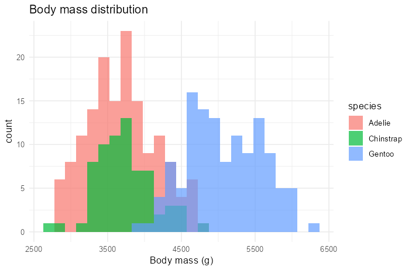

```python
(ggplot(penguins) + aes(x="flipper_length_mm", fill="species")
 + geom_density(alpha=0.6) + theme_light())
```

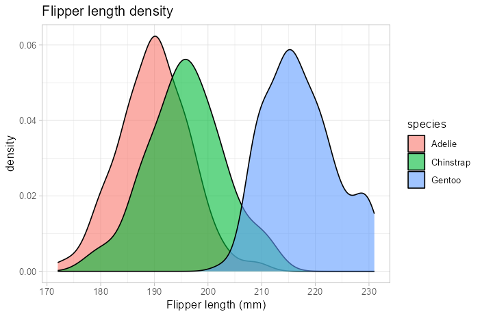

### Boxplot & violin

```python
(ggplot(penguins) + aes(x="species", y="body_mass_g", fill="species")
 + geom_boxplot() + geom_jitter(width=0.15, alpha=0.3, size=1)
 + theme_minimal() + theme(legend_position="none"))
```

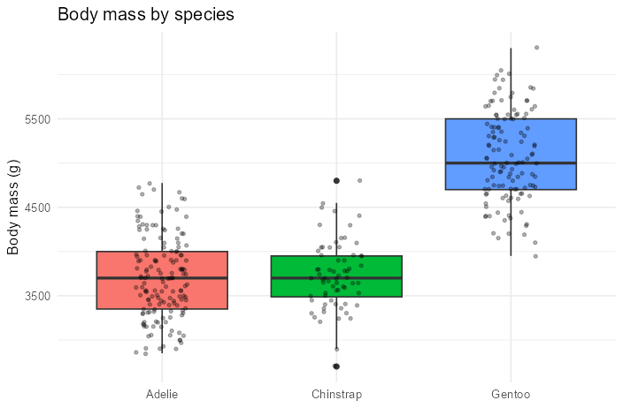

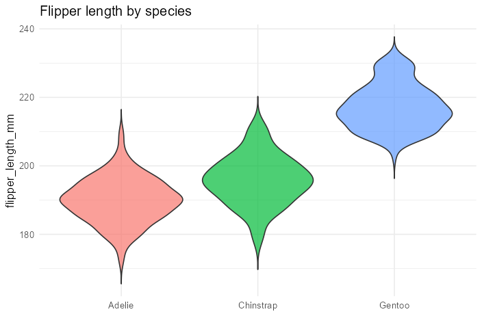

---

## Faceting

```python
(ggplot(penguins.dropna(subset=["sex"]))
 + aes(x="bill_length_mm", y="body_mass_g", color="sex")
 + geom_point(alpha=0.8) + facet_wrap("~ species") + theme_bw())
```

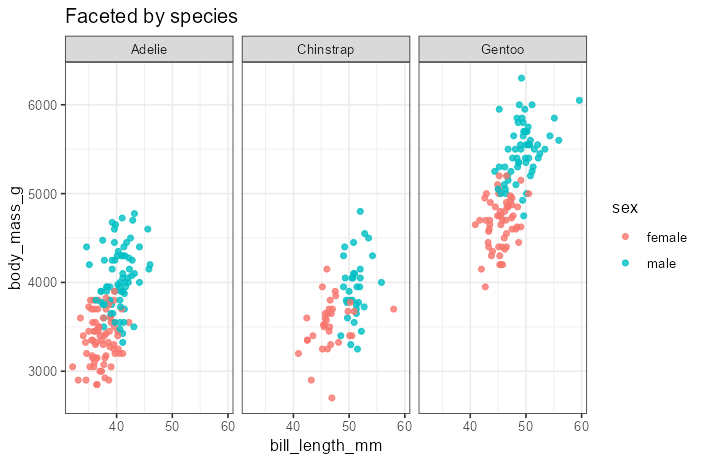

```python
... + facet_grid("sex ~ island")   # rows ~ cols
```

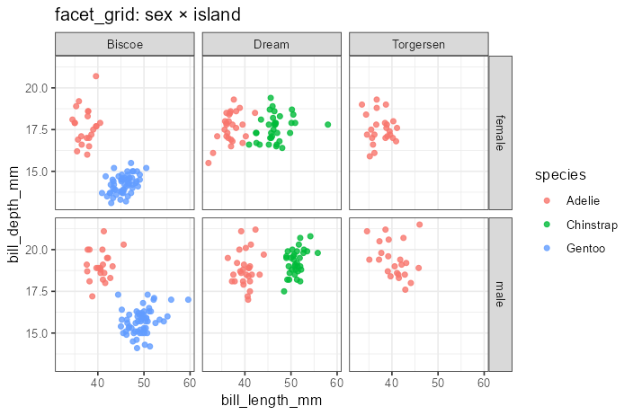

---

## Scales & color

```python
(ggplot(diamonds) + aes(x="carat", y="price", color="depth")
 + geom_point(alpha=0.4, size=1) + scale_color_viridis_c() + theme_minimal())
```

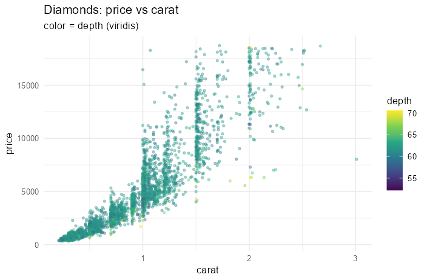

A Gapminder bubble chart — **log x-scale** and continuous size:

```python
(ggplot(gap[gap.year == 2007])
 + aes(x="gdpPercap", y="lifeExp", color="continent", size="pop")
 + geom_point(alpha=0.7) + scale_x_log10() + scale_size_continuous(range=(1, 12))
 + theme_minimal())
```

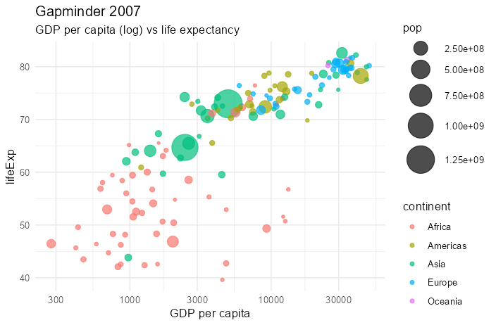

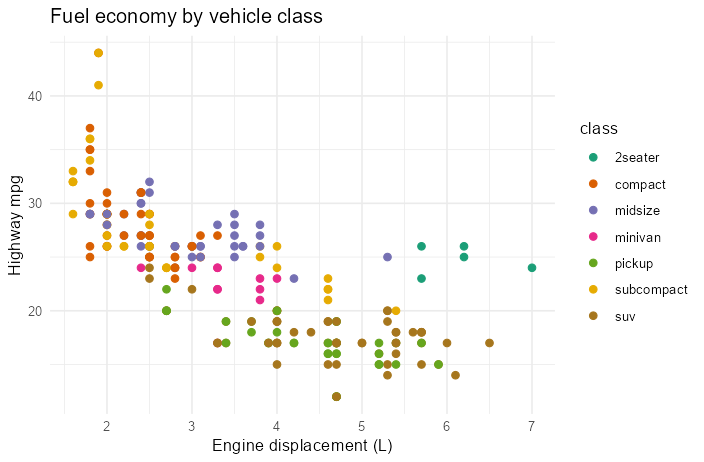

---

## Time series

```python
(ggplot(economics) + aes(x="date", y="unemploy")
 + geom_line(color="#2c3e50") + theme_minimal())
```

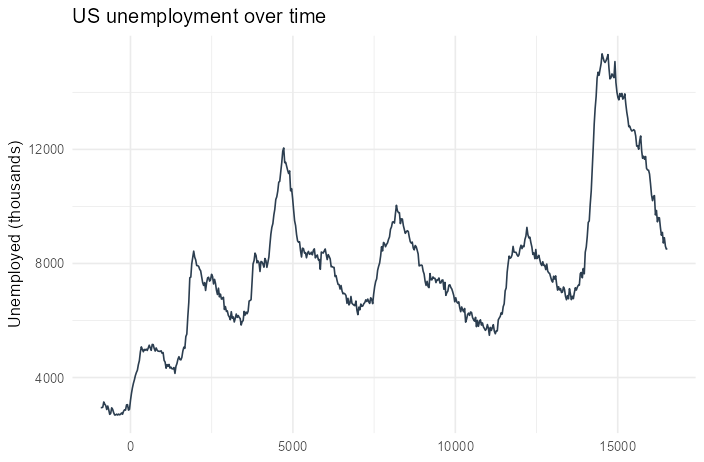

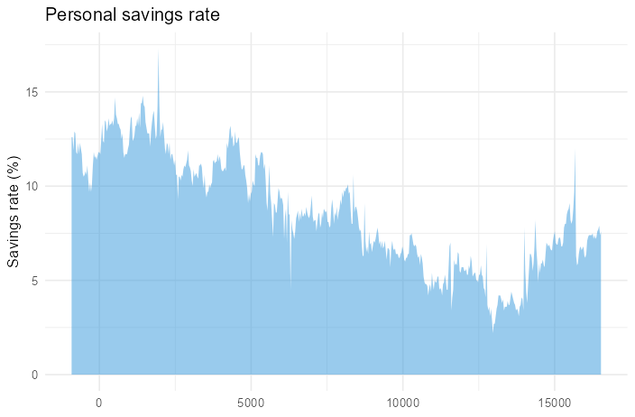

---

## 2-D density & bars

```python
(ggplot(diamonds) + aes(x="carat", y="price")
 + geom_bin2d(bins=30) + scale_fill_viridis_c() + theme_minimal())
```

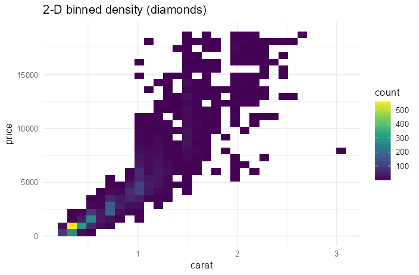

```python
(ggplot(penguins) + aes(x="island", fill="species")
 + geom_bar(position=position_dodge()) + theme_minimal())
```

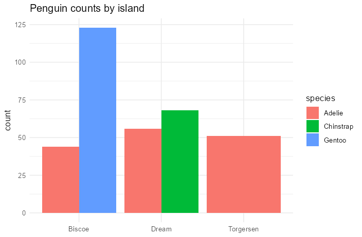

A bar chart in **polar coordinates** (`coord_polar`):

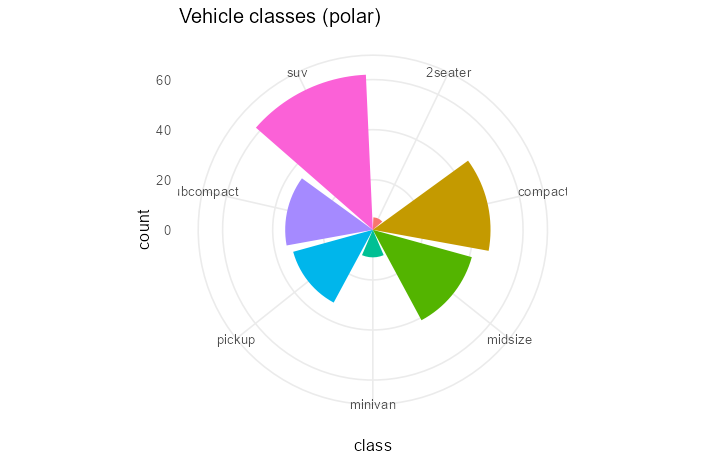

---

## Themes

Switch the entire look with one layer. Composed here 2×2 with **patchwork**:

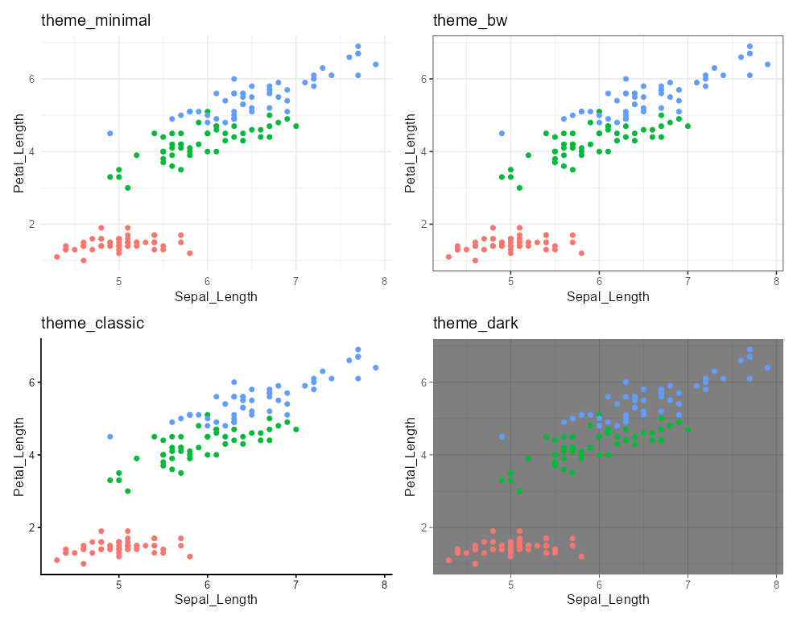

---

## 2-D density with hexbins

`geom_hex` (R `hexbin` package):

```python
(ggplot(diamonds) + aes(x="carat", y="price")
 + geom_hex(bins=30) + scale_fill_viridis_c() + theme_minimal())
```

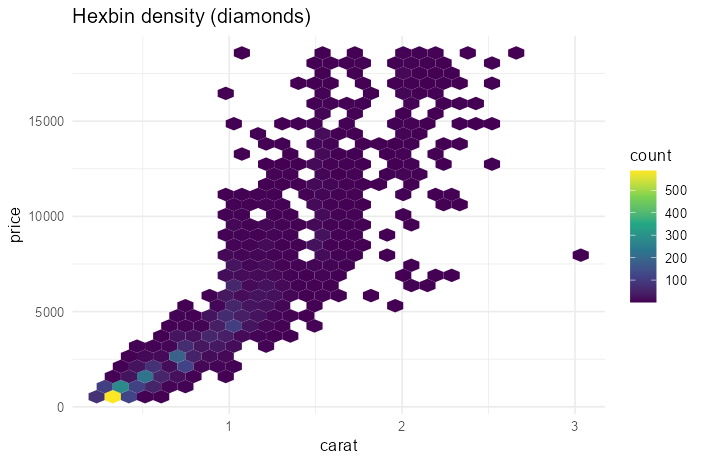

## Spatial maps (GeoPandas → sf)

`ggplot()` accepts a GeoPandas `GeoDataFrame` and routes it to R's `sf`, so
`geom_sf` draws choropleths from Python (`pip install ggplotpy[geo]` + `install.packages("sf")`):

```python
import geopandas as gpd
nc = gpd.read_file("nc.shp")           # North Carolina counties (bundled with sf)

(ggplot(nc) + geom_sf(aes(fill="SID74"))
 + scale_fill_viridis_c(option="magma") + theme_minimal())
```

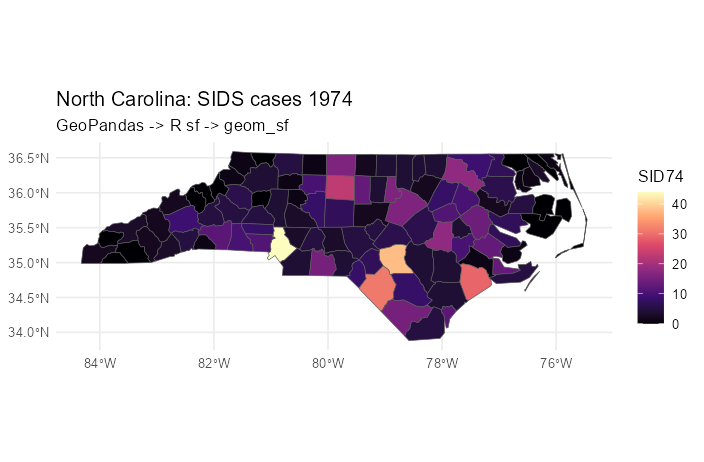

## Extension ecosystem (ggrepel)

Any installed ggplot2 extension is available via `ggplotpy.ext`. Here **ggrepel**
places non-overlapping text labels:

```python
from ggplotpy.ext import ggrepel

(ggplot(cars) + aes(x="displ", y="hwy", label="model")
 + geom_point() + ggrepel.geom_text_repel(max_overlaps=20) + theme_minimal())
```

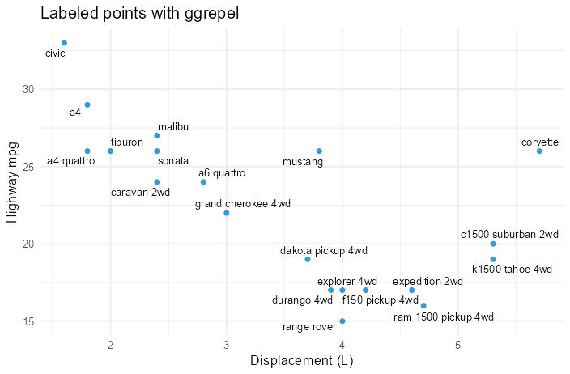

## Animation (gganimate)

ggplotpy renders gganimate animations to a GIF from Python. Here the classic
[Gapminder][gap] animation — GDP vs life expectancy evolving year by year
(`pip`-side nothing extra; in R: `install.packages(c("gganimate", "gifski"))`):

```python
from ggplotpy import *
from ggplotpy.core.animate import animate

anim = (ggplot(gap)
        + aes(x="gdpPercap", y="lifeExp", color="continent", size="pop")
        + geom_point(alpha=0.7) + scale_x_log10() + scale_size_continuous(range=(2, 12))
        + labs(title="Gapminder — year: {frame_time}")
        + theme_minimal()
        + R("gganimate::transition_time(year)"))   # transition_states also works

gif_bytes = animate(anim, width=640, height=420, fps=10, nframes=48)
open("gapminder.gif", "wb").write(gif_bytes)
```

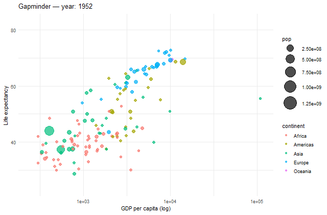

:::{note}
With ggplot2 4.0, prefer `transition_time(...)` / `transition_reveal(...)` /
`transition_states(..., wrap=False)` — gganimate's default wrap-around tweening in
`transition_states` currently errors against ggplot2 4.0's internals.
:::

## Advanced statistical layers

**ggdist** — a half-eye (slab + interval) with a boxplot, a "raincloud"-style summary:

```python
from ggplotpy.ext import ggdist

(ggplot(penguins) + aes(x="species", y="body_mass_g", fill="species")
 + ggdist.stat_halfeye(adjust=0.6, width=0.5, justification=-0.2)
 + geom_boxplot(width=0.12, alpha=0.5) + theme_minimal())
```

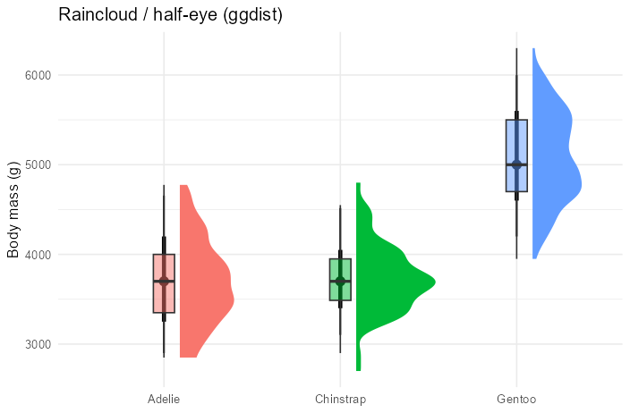

**ggridges** — overlapping density ridgelines:

```python
from ggplotpy.ext import ggridges

(ggplot(diamonds) + aes(x="price", y="cut", fill="cut")
 + ggridges.geom_density_ridges(alpha=0.7, scale=1.4)
 + scale_fill_viridis_d() + theme_minimal())
```

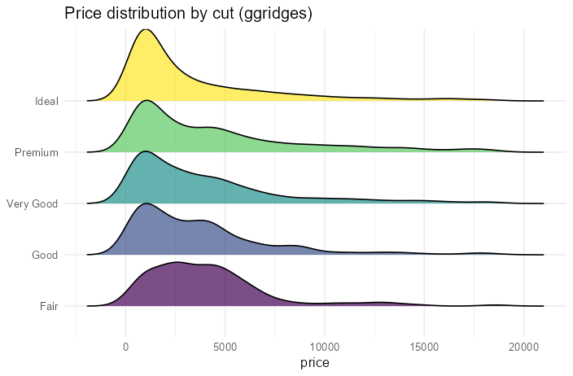

## Composition with patchwork

`|` places plots side by side, `/` stacks them — directly on ggplotpy plots:

```python
p1 = ggplot(penguins) + aes("bill_length_mm", "body_mass_g", color="species") + geom_point()
p2 = ggplot(penguins) + aes("species", "flipper_length_mm", fill="species") + geom_boxplot()
p3 = ggplot(penguins) + aes("body_mass_g", fill="species") + geom_density(alpha=0.6)

dashboard = (p1 | p2) / p3
```

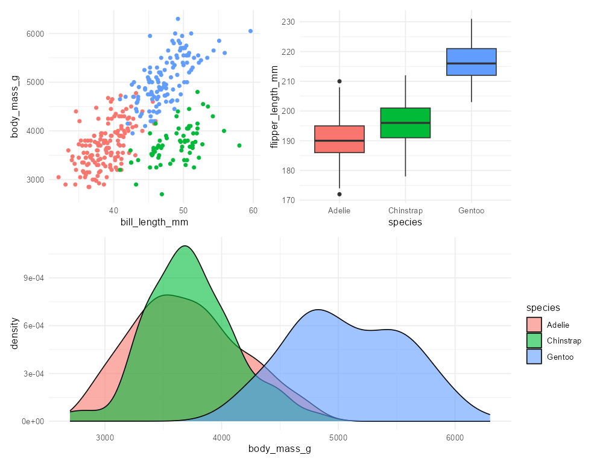

---

## Plot straight from Python data structures

No manual conversion — `ggplot()` accepts a `dict`, NumPy array, and more
(see [Data conversions](guides/data-conversions.md)).

```python
(ggplot({"month": list(range(1, 13)),
         "sales": [3, 5, 4, 7, 8, 6, 9, 11, 10, 8, 7, 12]})
 + aes(x="month", y="sales") + geom_col(fill="#e67e22")
 + scale_x_continuous(breaks=np.arange(1, 13)) + theme_minimal())
```

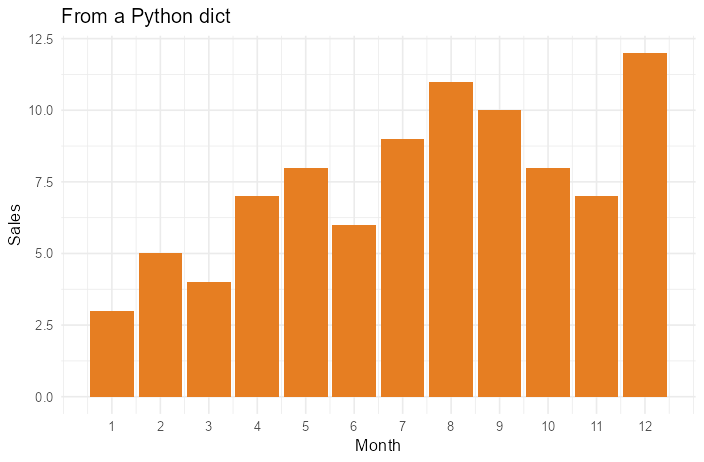

```python
arr = np.column_stack([np.random.normal(size=200), np.random.normal(size=200)*0.5 + 1])
(ggplot(arr) + aes("V1", "V2")            # 2-D array → columns V1, V2
 + geom_point(alpha=0.5) + geom_density2d(color="white") + theme_dark())
```

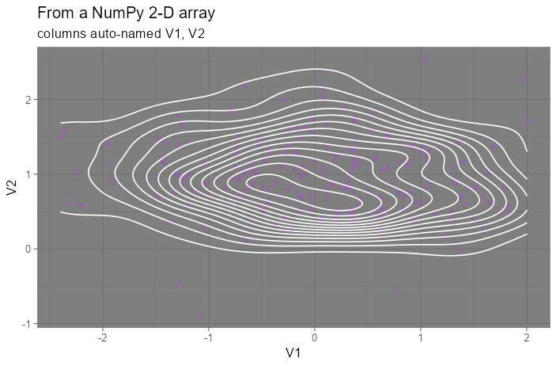

---

Want the exact R behind any plot? Call `print(p.to_r())`. Need a layer ggplotpy
doesn't model yet? Drop into raw R with `R("...")`. See the
[Quickstart](guides/quickstart.md) for both.
