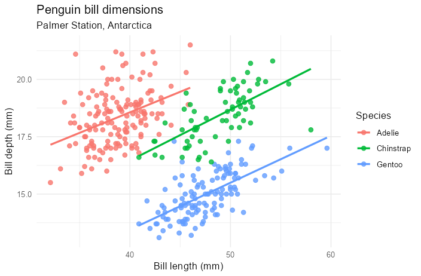

# ggplotpy

**Real ggplot2 from Python** — faithful `+` grammar, exact R parity via rpy2.

ggplotpy is not plotnine: it calls R's **real ggplot2** (and extension packages) in-process
so Jupyter plots, `to_r()` output, and **643** reflected wrappers match R where it matters.

```python
from ggplotpy import *
import pandas as pd

penguins = pd.read_csv("penguins.csv")
p = (ggplot(penguins)
     + aes(x="bill_length_mm", y="bill_depth_mm", color="species")
     + geom_point(size=2, alpha=0.8)
     + geom_smooth(method="lm", se=False)
     + theme_minimal())
p.save("out.png")   # or display inline in Jupyter (_repr_svg_)
```



See the **[Gallery](gallery.md)** for 19 more examples on real-world data.

## Install

Conda is the recommended path (R + rpy2 + ggplot2 together). See
[Getting started](getting-started.md) for `environment.yml`, `ggplotpy-bootstrap`, and Windows `R_HOME`.

```bash
conda env create -f environment.yml
conda activate ggplotpy
ggplotpy-bootstrap --profile core
python -c "from ggplotpy import check_setup; check_setup()"
```

```{toctree}
:maxdepth: 2
:hidden:

getting-started
guides/installation
guides/quickstart
gallery
guides/data-conversions
guides/troubleshooting
guides/colab
guides/databricks
api/index
```

::::{grid} 1 2 2 2
:gutter: 3

:::{grid-item-card} 🚀 Getting started
:link: getting-started
:link-type: doc

Install ggplotpy, verify R/ggplot2, and render your first plot.
:::

:::{grid-item-card} 📖 Quickstart
:link: guides/quickstart
:link-type: doc

Facets, extensions, patchwork, gganimate, lazy exports.
:::

:::{grid-item-card} 🖼️ Gallery
:link: gallery
:link-type: doc

20 real-data figures — geoms, scales, facets, themes, patchwork.
:::

:::{grid-item-card} 🔄 Data conversions
:link: guides/data-conversions
:link-type: doc

pandas, dict, NumPy, Arrow, polars, GeoPandas → R.
:::

:::{grid-item-card} 🔧 Installation
:link: guides/installation
:link-type: doc

Conda, pip + bootstrap, Docker, optional extras.
:::

:::{grid-item-card} 🩺 Troubleshooting
:link: guides/troubleshooting
:link-type: doc

R_HOME, missing packages, OOM-safe test tiers.
:::

:::{grid-item-card} ☁️ Colab
:link: guides/colab
:link-type: doc

System R setup and `display()` in Google Colab.
:::

:::{grid-item-card} 📊 Databricks
:link: guides/databricks
:link-type: doc

Arrow ingress, cluster init, `ggplotpy.display()`.
:::

:::{grid-item-card} 📚 API reference
:link: api/index
:link-type: doc

Core modules, 643-export reflection, `ggplotpy.ext`.
:::

:::{grid-item-card} 📓 Gallery notebooks
:link: https://github.com/Aakarsh751/ggplotpy/tree/main/notebooks
:link-type: url

01 mvp · 02 extensions · 03 synthetic gallery (tier3 CI).
:::

::::

## Why ggplotpy?

| Need | ggplotpy | plotnine |
|------|------|----------|
| Exact ggplot2 rendering | ✅ R backend | ❌ matplotlib reimplementation |
| Extension ecosystem (ggrepel, patchwork, …) | ✅ lazy `ggplotpy.ext` | ❌ partial / different |
| Mixed R–Python teams | ✅ shared `to_r()` | ❌ divergent semantics |
| Callable ggplot2 namespace | ✅ 643 exports; **108-layer render sweep, 0 failures** | ❌ Python reimplementation subset |
| Any Python data in | ✅ pandas/dict/NumPy/Arrow/polars/GeoPandas | ⚠️ pandas-centric |

## Engineering docs

Architecture, validation tiers, implementation plan, and coverage matrix live in the same
`docs/` folder but are **excluded** from this Sphinx site — see the
[GitHub tree](https://github.com/Aakarsh751/ggplotpy/tree/main/docs).

Contributors: [AGENTS.md](https://github.com/Aakarsh751/ggplotpy/blob/main/AGENTS.md), [STATUS.md](https://github.com/Aakarsh751/ggplotpy/blob/main/STATUS.md).
